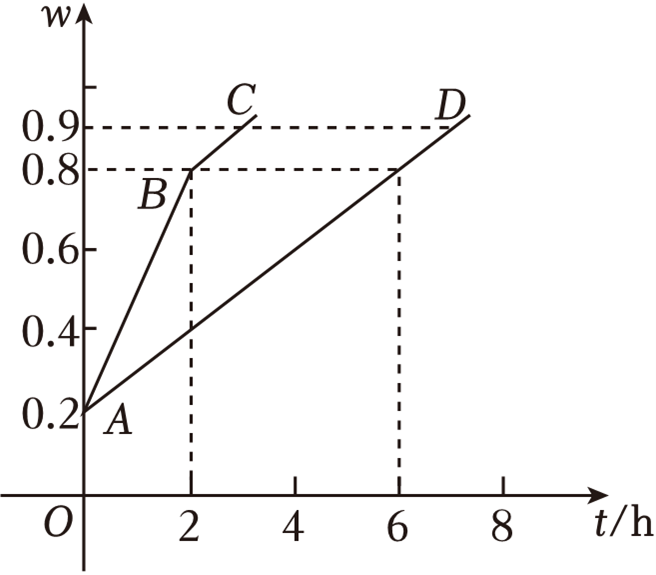
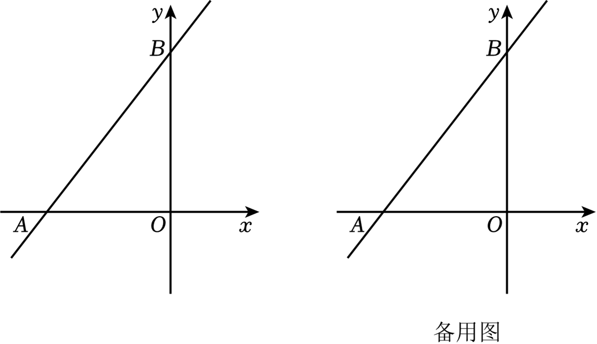
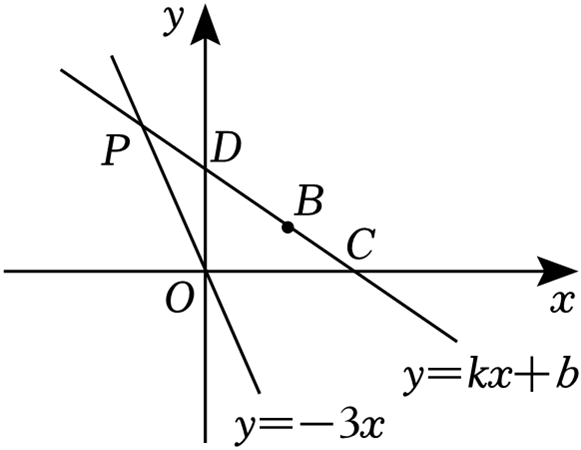

# 前言-如何学习
这是个关于
顺嘴说下，如果真的想做这方面，大致分为两方面兴趣类和竞赛向的，我推荐几本书，单遵老师（真大佬）的书都还不错可以自己挑选合适的书有竞赛向的也有兴趣类的（大佬是组合数学和数论方向的，担任过5次奥赛教练，也从事过数学教育论和数学科普相关工作），然后也可以去找其他的数竟教练的书。再就是兴趣类，其实这个方面我看的不多，只知道几本比如陈振宣老师的《初中数学思维方法全解与精炼》和《数学的雨伞下》这类，还有就是数学史相关的书籍了Victor J.Katz的《数学史通论》（这本书比较偏专业可能比较无聊）还有就是伊夫斯《数学史上的里程碑》克莱因的《古今数学思想》还有本《数学沉思录：古今数学思想的发展与演变》，这些书任选其一精读即可，其他可以做为泛读和参考

注意：题号前有*号的题目为综合题，最迟初三时可做
## 实数及其运算

#### 1. 数轴
1.1（2024•苏州）用数轴上的点表示下列各数，其中与原点距离最近的是 　　 
A. -3  B．1  C．2  D．3

#### 2. 相反数
2.1 （2024•盐城二模）若$m$的相反数是$\frac{1}{2023}$，则$m$的值为 　　 

#### 3. 绝对值
3.1 （2024•南京模拟）实数 $a,b$ 满足 $a<0,a^{2}>b^{2}$，下列结论：① $a<b$，②$b>0$，③$\frac{1}{a} < \frac{1}{b}$，④$|a| > |b|$．其中所有正确结论的序号是 　　 
A．①④	B．①③	C．②③	D．②④

#### 4. 科学计数法
4.1 （2024•灌云县二模）中国信息通信研究院测算，$2020-2025$ 年，中国 $5G$ 商用带动的信息消费规模将超过8万亿元，直接带动经济总产出达10.6万亿元．其中数据10.6万亿用科学记数法表示为

4.2 （2024•无锡模拟）用 $3D$ 打印技术打印出的高精密游标卡尺，其误差只有 $±0.000063$ 米，将0.000063用科学记数法表示为

#### 5. 平方根
5.1（2024•浦口区校级三模）已知 $x^{2} = 9$，则 $x$ 的值为

#### 6. 算数平方根
6.1 $9$ 的平方根是

#### 7. 实数的性质
7.1 （2024•海安市模拟）已知 $x$ 是整数，当$|x-√30|$取最小值时，$x$ 的值是

#### 8. 实数的大小比较
8.1（2024•鼓楼区二模）下列四个数中，最小的数是

A.-3 B.0 C.2 D.$-√5$

8.2 （2024•铜山区二模）已知 $a,b$ 两数在数轴上对应的点如图所示，下列结论错误的是

A.$a+b < 0$  B.$b-a > 0$  C.$ab > 0$  D.$|a|<|b|$

#### 9. 实数的大小比较
9.1 计算 $|2-√8| - 4cos45° - (-√3) + (-\frac{1}{3})^{-2}$

#### 10. 实数与数轴
10.1 （2023•玄武区一模）如图，数轴上 $A、B、C、D$ 两点分别对应实数 $a、b、c、d$，下列结论中一定正确的是

A.$a<b$ B.$\frac{1}{a} < \frac{1}{b}$ C. $a^{2} < b^{2}$ D.$\frac{a}{b} < \frac{b}{a}$

10.2 （2023秋•泰兴市期末）已知点 $A、B、C、D$ 在数轴上，点$A$和点$C$表示的数分别为 $-8、2$，点$B$在点$A$的右侧，点$D$在点$C$的右侧，且$AB = 4,CD = 2$．

（1）直接写出点$B$和点$D$表示的数分别为多少；

（2）若线段$AB$沿着数轴向右以2个单位长度/秒的速度运动，同时线段$CD$ 沿着数轴向左以1个单位长度/秒的速度运动，设运动的时间 $t$（秒）$t>0$ 

①若$B$和$D$重合，则$t$的值为  ，若$A$和$C$重合，则$t$的值为 ；

②若线段$AB$和线段$CD$重叠部分为$1$个单位长度，求运动时间$t$的值；

③当 $\frac{8}{3} < t <\frac{10}{3}$时，下面两个式子：① $BC + AD$；②$BC - AD$中有一个式子的值是定值，你认为是定值的式子是 　　（填写序号），并求这个定值．

10.3 （2024秋•无锡月考）如图在数轴上$A$点表示数$a$，$B$ 点表示数$b$， $a、b$ 满足 $|a+2| + |b-4| = 0$，问

（1）点$A$表示的数为　 ；点$B$表示的数为　　；

（2）一小球甲从点$A$处以1个单位/秒的速度向左运动；同时另一小球乙从点$B$处以2个单位/秒的速度也向左运动，设运动的时间为$t$（秒），

①当$t=1$时，甲小球到原点的距离为　　；乙小球到原点的距离为　　；当$t=3$时，甲小球到原点的距离为　　；乙小球到原点的距离为　　；

②试探究：甲，乙两小球到原点的距离可能相等吗？若不能，请说明理由．若能，请求出甲，乙两小球到原点的距离相等时经历的时间．

#### 11. 数形结合
11.1 （2023秋•鼓楼区期末）阅读材料，回答问题：
如图1，点$A,B$在数轴上对应的数分别为$a,b$．若点$C$在数轴上，且$AC = BC$，则点$C$表示的数为$\dfrac{a+b}{2}$，理由如下：

设点$C$表示的数为$x$
$∵AC = x-a,BC = b-x,AC=BC$
$x-a=b-x$
于是得到结论

（1）如图2，点$C,D$在$A,B$两点之间，对应的数分别为$x,y$，且$AC=CD=DB$．

①若$a=-1,b=5$，则$x,y$分别是多少， 　　．

②小明同学认为$x=\dfrac{2a+b}{3},y=\dfrac{a+2b}{3}$，你同意吗？若同意，请证明；若不同意，请说明理由．

（2）如图3，点$E$在$A,B$两点之间，对应的数为$z$，且$AE:BE = m:n$．则$z= $ 　　（用含$a,b,m,n$的代数式表示）．

## 一元二次方程

#### 1. 一元二次方程的一般形式
1.1（2022•常州模拟）将一元二次方程$x^{2}+x=1$化成一般形式$ax^{2}+bx+c=0(a>0)$之后，一次项系数和常数项分别是

#### 2. 一元二次方程的几种解法
包括直接开平方法、配方法、公式法、因式分解法，我们来看几个典例

2.1 （2024•常熟市模拟）我们规定一种运算：若 $a=(x_{1},y_{1}),b=(x_{2},y_{2})$，则$a⋅b=x_{1}x_{2}+y_{1}y_{2}$．已知 $a=(x-1,x+1),b=(x+3,4)$，若$a⋅b=7$ ，且 $-2<x<3 $，则$x$的值为 　 　．

2.2 （2024•天宁区校级模拟）解下列方程：

（1） $x^{2} - 2x -1 =0$；

（2） $3x(x-1) = 2(1-x)$．

#### 3. 根的判别式

3.1（2024•宿城区校级二模）对于关于 的一元二次方程 的根的情况，有以下四种表述：
①当$a<0,b+c>0,a+c<0$时，方程一定没有实数根；

②当 $a<0,b+c>0,b-c<0$时，方程一定有实数根；

③当 $a>0,a+b+c<0$时，方程一定没有实数根；

④当 $a>0,b+4a=0,4a+2b+c=0$ 时，方程一定有两个不相等的实数根．

#### 4. 根与系数的关系
4.1 （2024•鼓楼区校级模拟）若关于$x$的方程 $ax^{2}+bx+c≠0(a≠0)$的两根之和为 $p$，两根之积为 $q$，则关于$x$的方程$a(y-2)^{2}+b(y-2)+c=0$的两根之积是

4.2 （2023•建湖县校级模拟）对于任意实数$a,b$，我们定义新运算$"*"：a*b = a^{2}+2ab-b^{2}$ ，若 $m,n$是方程$(x+2)*3=0$的两根，则$\frac{n}{m} + \frac{m}{n}$的值为 　 　．

#### 5. 简单应用
5.1 （2024•邗江区校级三模）为增强学生身体素质，提高学生篮球运动竞技水平，我市开展“市长杯”篮球比赛，赛制为单循环形式（每两队之间赛一场）．现计划赛程3天，每天安排5场比赛，则应邀请多少个球队参赛．

5.2 （2024•泰兴市二模）随着新能源电动汽车的快速增加，某市正在快速推进全市电动汽车的充电桩建设，已知到2023年底，该市约有3.5万个充电桩，根据规划到2025年底，全市的充电桩数量将会达到5.04万个，则从2023年底到2025年底，该市充电桩数量的年平均增长率为多少？

5.3（2024•姜堰区二模）某地建立了一个劳动实践基地，小亮从中了解到如下信息：
信息 年计划将100亩的土地全部种植甲乙两种蔬菜；其中，甲种蔬菜种植面积不少于20亩，乙种蔬菜种植面积不少于50亩；
信息2：甲种蔬菜每亩种植成本 （单位：元）与其种植面积 （单位：亩）之间满足函数关系为$y=\frac{1}{2}x+10$，乙种蔬菜每亩种植成本为50元．
根据以上信息完成下列问题：

（1）若甲种蔬菜每亩种植成本30元，求乙种蔬菜总种植成本；

（2）如何分配两种蔬菜的种植面积，使甲乙两种蔬菜总种植成本为4272元？

5.4 已知$xy = -9$，则$x^{2}+4x+y^{2}-4y+10$的最小值是

5.5 设实数 $x、y、z$ 满足 $x+y+z=4$ ，则代数式$xy+2yz+xz$的最大值是

5.6 已知实数 $a、b$ 满足 $a^{2}+ab+b^{2}=1$，若$p=ab+2a+2b$，则$p$的最小值为 　

5.7 （2024•宝应县一模）在数学课上，老师要求同学们将一个关于字母$x$的二次三项式 $2x^{2}+bx+c$ （ $b、c$是常数）配成$2(x-m)^{2}-3$（$m$是常数）的形式，则$b+c$的最小值是

#### 6. 实际问题
有很多种，常见的有传播增长率图形变化销售等

6.1（16-17九年级上·山东济宁·期中）有x支球队参加篮球比赛，共比赛了45场，每两队之间都比赛一场，则列出符合题意的方程是

6.2（2021·江苏盐城·一模）据美国约翰斯霍普金斯大学发布的全球新冠肺炎数据实时统计系统，截至美国东部时间3月28日晚6时，全美共报告新冠肺炎确诊人数超过3025万，死亡超过54.9万．已知有一人患了新冠肺炎，经过两轮传染后，共有144人患了新冠肺炎，每轮传染中平均每人传染了多少人．

6.3 （2024·江苏常州·模拟预测）某品牌新能源汽车2021年的销售量为20万辆，随着消费人群的不断增多，该品牌新能源汽车的销售量逐年递增，2023年的销售量比2021年增加了31.2万辆．

(1)求从2021年到2023年该品牌新能源汽车销售量的平均年增长率；

(2)按照（1）中所求平均年增长率计算2024年该品牌新能源汽车的销售量．

6.4（2023·江苏南通·二模）我国明代数学著作《算学宝鉴》中记载一个问题：“门厅一座，高广难知．长竿横进，门狭四尺．竖进过去，竿长二尺．两隅斜进，恰好方齐，请问三色，各该有几？”译文：现在有一座门（矩形），不知道高度和宽度，如果拿支长竹竿横着过，门的宽度比竹竿的长度少四尺；拿竹竿竖着过，竹竿的长度比门的高度多二尺；沿对角线斜着进，恰好通过．问门的高度、宽度及竹竿的长度各是多少尺？设竹竿的长度为x尺，请列出方程．

6.5 （22-23九年级上·山东临沂·阶段练习）某款网红产品很受消费者喜爱，每个产品的进价为40元，规定销售单价不低于44元，且不高于52元．某商户在销售期间发现，当销售单价定为44元时，每天可售出300个，销售单价每上涨1元，每天的销量减少10个．现商家决定提价销售，设每天销售量为$x$个，销售单价为$y$元．

(1)直接写出$y$与$x$之间的函数关系式和自变量$x$的取值范围．

(2)将产品的销售单价定为多少元时，商家每天销售产品获得的利润$w$（元）最大？最大利润是多少元？

(3)该商户从每天的利润中捐出200元做慈善，为了保证捐款后每天剩余利润等于2200元，求销售单价$x$的值．

6.6（2024·江苏常州·模拟预测）常州市著名旅游景区“中华恐龙园”应疫情防控要求，严格控制每日来访旅客人数．已知于2019年春节长假期间，共接待游客达20万人次，而在2021年春节长假期间，接待游客仅达16.2万人次．

(1)则“中华恐龙园”2019至2021年春节长假期间接待游客人次的年平均减少率为多少；

(2)“中华恐龙园”景区内一奶茶店销售一款奶茶，每杯成本价为6元，根据销售经验，在旅游旺季，若每杯定价25元，则平均每天可销售300杯，若每杯价格降低1元，则平均每天可多销售30杯，2022年春节期间，店家决定进行降价促前活动，则当每杯售价定为多少元时，既能让顾客获得最大优惠，又可让店家在此款奶茶实现平均每天6300元的利润额？

*6.7 （2023·江苏常州·一模）如图，在平面直角坐标系中，直线$y=3x+b$经过点$A(-1,0)$，与y轴正半轴交于$B$点，与反比例函数$y=\frac{k}{x}(x>0)$交于点$C$，且 $BC=2AB$，$BD∥x$ 轴交反比例函数$y=\frac{k}{x}(x>0)$于点$D$．

（1）问 $b、k$ 分别是多少

(2)若点E为射线BC上一点，设E的横坐标为m，过点E作$EF∥BD$，交反比例函数$y=\frac{k}{x}(x>0)$于点F．若$EF=\frac{1}{3}BD$，求m的值．

*6.8 （2024·江苏徐州·二模）已知$\triangle ABC$是等腰直角三角形，$∠C = 90°,AC=BC$．

（1）当 $AC = BC =6$ 时

① 如图①，将直角的顶点D放至$AB$的中点处，与两条直角边$AC、BC$分别交于点 $E、F$，请说明$\triangle DEF$等腰直角三角形

②如图②，将直角顶点D放至 $AC$ 边的某处，与$\triangle ABC$另两边的交点分别为点E、F，若$\triangle DEF$等腰直角三角形且面积为4，求$CD$的长．

(2)若等腰直角三角形$\triangle DEF$三个顶点分别在等腰直角$\triangle ABC$的三边上，$\triangle DEF$的直角边长为1时，求等腰直角$\triangle ABC$的直角边长的最大值．

6.9 （2024·江苏苏州·二模）“今天立夏，过来吃碗三虾面．”在百年老字号裕面堂内，一位老苏州说，苏州人立夏传统“尝三鲜”是蚕豆、苋菜、蒜苗，今年立夏提前吃碗夏令三虾面尝尝鲜．为了抓住这一商机，两商户决定生产预制面．据统计，甲商户每小时生产600包，乙商户每小时生产800包，甲乙两商户每天共生产16小时，且每天生产的三虾面总包数为11400包．

(1)甲、乙两商户每天分别生产多少小时？

(2)由于三虾面在网上直播热销，客户纷纷追加订单，两商户每天均增加了生产时间，其中甲商户比乙商户多增加2小时，在整个生产过程中，甲商户每小时产量不变，而乙商户由于机器损耗及人员不足，每增加一个小时，每小时产量将减少140包，这样两商户一天生产的面条总量将比原来多1200包．求：甲商户增加的生产时间为多少小时？

## 平面直角坐标系与函数初步

#### 点的位置与坐标
1.1 （2024•秦淮区校级三模）已知点$P(2,-3)$关于$y$轴的对称点为$Q(a,b)$，则$a+b$的值是多少

1.2 （2023•南京模拟）点$M$位于平面直角坐标系第四象限，且到$x$轴的距离是5，到$y$轴的距离是2，则点$M$关于原点对称的点$M'$的坐标是多少

*1.3 （2023•新北区校级二模）如图，在平面直角坐标系中，$A、B、C$ 三点的坐标分别为 $(\frac{1}{2},1),(4,1),(3,0)$，点$P$为线段$AB$上的一个动点，连接$PC$，过点$P$作$PQ⟂PC$交$y$轴于点$Q$，当点$P$在$AB$上运动时，点$Q$随之运动，设点$Q$的坐标为$(0,t)$，则$t$的取值范围是多少

#### 找规律

*2.1（2021•清江浦区二模）如图，直线$l$的函数表达式为 $y=2x$，过点$A_{1}(1,0)$作$A_{1}B_{1}⟂x$轴，与直线$l$交于点$B_{1}$，以原点$O$为圆心，$OB_{1}$长为半径画圆弧交$x$轴于点$A_{2}$；再作$A_{2}B_{2}⟂x$轴，交直线$l$于点$B_{2}$，以原点$O$为圆心，$OB_{2}$长为半径画圆弧交$x$轴于点$A_{3}$； ，按此作法进行下去，则点$A_{2021}$的坐标为

2.2 （2022•南京）如图，在平面直角坐标系中，横、纵坐标均为整数的点按如下规律依序列： $(0,0)(1,0)(0,1)(2,0)(1,1)(0,2)(3,0)(2,1)(1,2)(0,3)(4,0)(3,1)(2,2)(1,3)$，按这个规律，$(6,7)$ 是第多少个点

#### 距离相关
3.1 （2022•江阴市模拟）如图，半径为1的$☉O$的圆心在坐标原点，$P$为直线$y = 2x+1$上一点，过点$P$作$☉O$的切线，切点为$A$，连接$OA,OP$．下列结论：

①当$\triangle OAP$为等腰直角三角形时，点$P$坐标为$(1,1)$ ；

②当$∠AOP = 60°$时，点$P$坐标为$(2,0)$；

③ $\triangle OAP$面积最小值为$0.5$ ；

④ $∠APO = 45°$
其中正确的有哪几个

3.2 （2019•滨湖区模拟）在平面直角坐标系中，点$P$的坐标为$(0,2)$，点$M$的坐标为$(m-1,-\frac{3}{4}m-\frac{9}{4})$（其中$m$为实数），当$PM$的长最小时，求 $m$ 的值

#### 求自变量或者因变量的取值范围
* 函数解析式为整式时，字母取值范围为全体实数； 
* 函数解析式含有分式时，分式的分母不能为零；
* 函数解析式含有二次根式时，被开方数大于等于零；
* 函数解析式中含有指数为零的式子时，底数不能为零；
* 实际问题中函数取值范围要和实际情况相符合，使之有意义.

 　　 
4.1 （2022•张家港市一模）对于函数$y=\dfrac{3-2x}{5}$，自变量$x$的取值范围是多少

4.2 图1是变量$x$与变量$y$的函数关系的图象，图2是变量$z$与变量$y$的函数关系的图象，则$z$与$x$的函数关系的图象可能是

4.3 （2024•南京自主招生）将$y=\frac{4}{x}$向右平移两个单位，向下平移1个单位，与$y=kx-2k-1$有两个交点，分别为$(a,m),(n,b)$，则$(a-2)(b+1)$ 是多少

4.4 （2021•梁溪区校级二模）如图，$\triangle ABC$中， $∠ACB=90°$，$AB = 10$，$BC = 2√5$ ．点$P$是斜边$AB$上一个动点．过点$P$作$PQ⟂AB$，垂足为$P$，交边$AC$（或边$CB$于点$Q$，设$AP = x$，$\triangle APQ$的面积为$y$，则$y$与$x$之间的函数图象大致为

*4.5 （2022•邳州市校级模拟）在同一平面直角坐标系中，函数$y=ax+a$和函数$y=ax^{2}+x+2$，$a$是常数，且$a≠0$的图象可能是 　　 

#### 分析题
5.1 （2024•常州）在马拉松、公路自行车等耐力运动的训练或比赛中，为合理分配体能，运动员通常会记录每行进$1km$所用的时间，即“配速”（单位：$km/min$．小华参加$5km$的骑行比赛，他骑行的“配速”如图所示，则下列说法中错误的是 　　 

5.2 （2024•高港区三模）为了解某新能源汽车的充电速度，实验小组调查研究发现：当汽车充电率$w$（充电率$w=\dfrac{充电电量}{电池容量}$） 满足$0.2 ≤ w < 0.9$时，用该品牌汽车专用充电桩充电，汽车充电率$w_{1}$与充电时间$t$（单位:$h$） 的函数图象是折线$ABC$ ；用公共充电桩充电时，汽车充电率$w_{2}$与充电时间$t$（单位：$h$） 的函数图象是线段$AD$ ．研究表明：为保护电池寿命，当充电率超过0.8时，品牌专用充电桩的充电速度与公共充电桩充电速度相同．根据以上信息，回答下列问题：

（1）求$AD$的函数解析式．

（2）若该汽车充电率从0.2至0.9，用品牌专用充电桩比公共充电桩充电少用多少时间？

## 一次函数的图像及其性质
说几句废话

1. 如何在函数的基础上理解一次函数，它的图像与性质有什么特点，举个例子，如果自己写出几个一次函数，尝试画出函数图象，回答出这个函数的交点，单调性

2. $k,b$ 的意义以及对两个直线的位置关系的意义

3. 待定系数法

4. 数形结合，一次函数与一元一次方程以及二元一次方程组、医院一次不等式组的关系

#### 待定系数法
10.1（2023•靖江市模拟）已知直线$y=\dfrac{4}{3}x+4a(a>0)$ 与$x$轴交于点$A$，与$x$轴交于点$B$

（1）直接写出$A、B$两点的坐标（用含有$a$的代数式表示）；

（2）当$a=1$时，在双曲线$y=\dfrac{a}{x}$位于直线$AB$下方的图象上找一点$D$，使得$S_{\triangle ABD} = 4$，求出点$D$的坐标；

（3）点$C$在$y$轴上，坐标为$(0,na)$，且直线$y=kx+\dfrac{3}{7}k-7(k≠0)$过一定点$(n,-7)$，试判断$∠BAC - 2∠OAC$的值是否会发生变化．若不变化，请求出该值；若变化，请说明理由．

#### 求直线与坐标轴围成的面积
10.2（2022秋•兴化市校级期末）如图，正比例函数$y=-3x$的图象与一次函数$y=kx+b$的图象交于点 ，一次函数图象经过点 ，与 轴的交点为 ，与 轴的交点为 ．

（1）求一次函数表达式；

（2）求$\triangle COP$的面积．

## 几何题复习
说到底，其实我很不愿意写这玩意儿，为啥，因为学着没啥用，除非你学的时候用心用脑，否则我个人认为培养点逻辑和兴趣即可，别把时间精力大部分花在这儿，后面相关的数学知识可和这玩意一点不相干，可别走火入魔了

#### 
